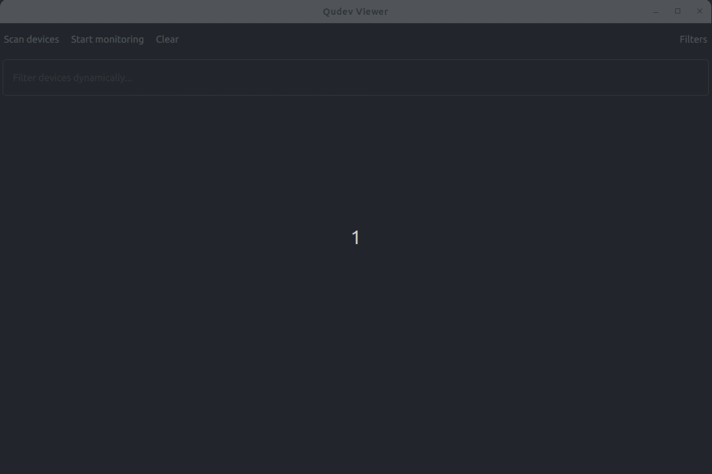

# qudev – Qt wrapper around libudev + QML viewer

`qudev` is a small C++/Qt6 library that wraps [libudev](https://www.freedesktop.org/software/systemd/man/libudev.html) (udev) on Linux and provides a QML/QtQuick example viewer for enumerating and monitoring devices.

  

---

## Features

- **High-level façade**: `Qudev` class for enumeration + monitoring.
- **Device representation**: `QudevDevice` as a Qt metatype  
  (easy to use in signals/slots, QVariant, QML).
- **Filtering** (`QudevFilters`):
  - Exact matches on subsystem, devtype, sysname, devnode, syspath prefixes.
  - Property and sysattr matching / non-matching.
  - Tag and action filters.
- **Enumeration** (`Qudev::enumerate()`):
  - Snapshot of all devices matching the current filters.
- **Monitoring**:
  - Event-based device notifications via the `deviceFound(const QudevDevice&)` signal.
  - Internally uses `QSocketNotifier` and libudev monitors.
- **Example viewer** (`udevviewer`):
  - Qt Quick / Material UI.
  - Tree view of devices grouped by subsystem.
  - Filter drawer for building `QudevFilters`.
  - Demonstrates how to use the synchronous library from QML in an
    **asynchronous** way via a dedicated `QudevService` wrapper.

---

## Requirements

- **Qt**: Qt 6.5+ (Core, Gui, Qml, Quick)
- **libudev** (from systemd or eudev), accessible via `pkg-config libudev`
- **CMake**: 3.23+
- A C++17-capable compiler

---

## Building

### Command line

    git clone https://github.com/GregorSuperSamsa/qudev
    cd qudev

    # Configure (adjust CMAKE_PREFIX_PATH to your Qt if needed)
    cmake -S . -B build \
          -DQUDEV_BUILD_EXAMPLES=ON \
          -DQUDEV_BUILD_TESTS=OFF \
          -DQUDEV_BUILD_DOCS=ON

    # Build library + example
    cmake --build build

This will produce:

- `build/src/libqudev.a` (or `.so`)
- `build/examples/udevviewer/udevviewer` – the example app

### Qt Creator

- Open `CMakeLists.txt` as a project.
- In the **CMake configuration** step, make sure:
  - `QUDEV_BUILD_EXAMPLES` is `ON` if you want the viewer.
  - `QUDEV_BUILD_DOCS` is `ON` if you want the Doxygen target.
- Select the desired configuration (Debug/Release) and build normally.

---

## Running the example viewer

After building:

    cd build
    ./examples/udevviewer/udevviewer

You should see a dark Material-themed window:

- **Scan devices** enumerates devices matching the current filters.
- **Start monitoring / Stop monitoring** toggles live monitoring of new events.
- **Filters** opens a side drawer where you can edit `QudevFilters` from QML.
- The device tree groups devices by subsystem and exposes properties, sysfs
  attributes, tags, and other metadata.

> Note: libudev typically requires access to `/sys` and `/dev`, so the
> example is intended to run on a Linux system with udev.

---

## Documentation (Doxygen)

Doxygen configuration is provided via `Doxyfile`. To generate HTML docs:

    # From the build directory configured with QUDEV_BUILD_DOCS=ON
    cmake --build build --target doc

This will generate HTML documentation in:

    docs/html/index.html

Open that file in a browser to explore the API (public headers under `include/`
are the interesting bits).

---

## License

This project is licensed under the **MIT License**.  
See the `LICENSE` file for full license text.
